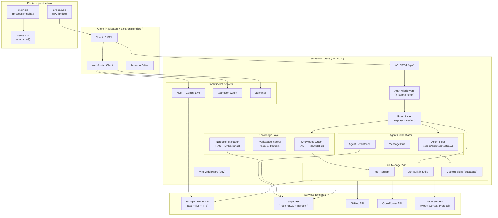

# Architecture — Leanna AI Operating System

## Vue d'ensemble

Leanna est une application full-stack monoprocessus en développement et deux processus en production Electron. Le frontend React est servi par le même serveur Express qui expose l'API REST et les WebSockets. En mode desktop, Electron embarque le tout dans un processus Node.js unique.



---

## Frontend

### Structure des composants

```
src/
├── main.tsx                    # Bootstrap : providers, routing, auth gate, circuit breaker fetch
├── views/                      # Pages (chargées lazy)
│   ├── IdeView.tsx             # IDE principal (Monaco + terminal + panels)
│   ├── NotebooksView.tsx       # RAG notebooks (chat + sources)
│   ├── GitHubView.tsx          # Intégration Git/GitHub
│   ├── AutomationView.tsx      # Workflows et tâches planifiées
│   ├── DocumentsView.tsx       # Gestion de documents
│   ├── MemoriesView.tsx        # Mémoires long-terme Supabase
│   ├── HistoryView.tsx         # Historique conversations
│   ├── ListsView.tsx           # Listes intelligentes
│   └── SettingsView.tsx        # Paramètres, tokens, profil
├── components/
│   ├── UnifiedSidebar.tsx      # Navigation latérale (contexte global / IDE)
│   ├── FloatingOrb.tsx         # Orb flottant draggable (chat rapide hors IDE)
│   ├── CriticalEditConfirm.tsx # Confirmation avant modif de fichiers critiques
│   ├── StartupProjectModal.tsx # Sélecteur de workspace au démarrage
│   ├── ide/                    # FileExplorer, EditorTabs, composants IDE
│   ├── panels/                 # SandboxPanel, AgentPanel, VisionPanel
│   ├── sidebar/                # Éléments de la sidebar
│   ├── settings/               # Sous-vues des paramètres
│   ├── notebooks/              # Composants notebooks RAG
│   ├── workflows/              # Constructeur de workflows
│   ├── github/                 # Composants GitHub
│   ├── knowledge/              # Composants Knowledge Graph
│   └── ui/                     # Toast, ConfirmDialog, composants génériques
├── context/
│   ├── LiveAPIContext.tsx       # Connexion WebSocket Gemini Live
│   ├── UserProfileContext.tsx   # Profil utilisateur (nom, voix, thème…)
│   └── ScreenShareContext.tsx   # Capture et streaming d'écran vers Gemini
├── hooks/
│   └── useLiveAPI.ts           # Hook principal WebSocket Live (connect/disconnect/send)
└── services/
    ├── ideApi.ts               # Client REST pour les opérations IDE (arbre, CRUD fichiers)
    ├── sandboxApi.ts           # Client REST pour le sandbox
    └── supabase.ts             # Client Supabase (frontend)
```

### Routing

React Router v7, mode `BrowserRouter`. Toutes les routes sont chargées en `lazy` pour le code splitting :

| Route | Vue | Description |
|---|---|---|
| `/` | → redirect `/ide` | Redirection par défaut |
| `/ide` | `IdeView` | IDE Monaco + chat + panels |
| `/memories` | `MemoriesView` | Mémoires Supabase |
| `/history` | `HistoryView` | Historique des conversations |
| `/settings` | `SettingsView` | Configuration complète |
| `/lists` | `ListsView` | Listes intelligentes |
| `/github` | `GitHubView` | Git / GitHub |
| `/automation` | `AutomationView` | Workflows et tâches planifiées |
| `/documents` | `DocumentsView` | Documents uploadés |
| `/notebooks` | `NotebooksView` | RAG notebooks |

Les transitions de routes sont animées avec `motion/react` (`AnimatePresence` + `mode="wait"`).

### Gestion d'état

- **React Context** : `LiveAPIContext` (WebSocket), `UserProfileContext` (profil + thème), `ScreenShareContext` (capture vidéo)
- **État local** : hooks `useState` / `useReducer` dans les composants
- **Persistance frontend** : `localStorage` (`Leanna_api_token`, `Leanna_user_profile`)
- **Pas de store global** (Redux/Zustand) : l'état métier est dans les contextes et remonte vers le serveur

### Optimisations réseau (frontend)

Le `window.fetch` est patché dans `main.tsx` avec :
- **Injection automatique** du header `x-leanna-token` sur toutes les requêtes `/api/*`
- **Déduplication in-flight** : les GET identiques en parallèle ne déclenchent qu'une seule requête
- **Circuit breaker** : après 12 échecs réseau consécutifs, toutes les requêtes API renvoient 503 pendant 8 secondes pour prévenir le ENOBUFS

---

## Backend / API

### Couches applicatives

```
server-bootstrap.ts          # 1. Charge .env, déchiffre les clés sensibles, valide Supabase
server.ts                    # 2. Initialise tout et démarre le serveur HTTP
  ├── bootstrapRuntimeSync() # 3. Enregistre tous les skills dans le ToolRegistry
  ├── agentOrchestrator      # 4. Connecte l'orchestrateur au SkillManager
  ├── loadWorkflows()        # 5. Charge les workflows planifiés depuis Supabase
  ├── loadScheduledTasks()   # 6. Charge les tâches automation
  ├── projectIndexer.scanAll()# 7. Lance l'indexation du Knowledge Graph
  └── startServer()          # 8. Express + WebSocket servers
```

### Middlewares (ordre d'application)

1. **Rate limiters globaux** (`express-rate-limit`) — configurés dans `server/config/rateLimits.ts`
2. **Compression** (`compression`) — gzip sur les réponses
3. **Static files** — `dist/` en production, Vite middleware en développement
4. **`requireAuth`** — vérifie le header `x-leanna-token` sur toutes les routes `/api/*` sauf `/api/health`
5. **Routeurs modulaires** — un fichier par domaine dans `server/routes/`
6. **Error handler global** — catch-all Express en fin de chaîne

Domaines d'API montés (voir [API_DOCS.md](API_DOCS.md) pour le détail des endpoints) :

`/api/health` · `/api/ide` · `/api/sandbox` · `/api/agents` (+ `/api/v2/agents`, `/api/v2/metrics`) · `/api/agent-builder` · `/api/agent-registration` · `/api/custom-agents` · `/api/workflows` · `/api/conversations` · `/api/memories` · `/api/memory/hierarchical` · `/api/skills` · `/api/custom-skills` · `/api/git` · `/api/github` · `/api/profile` + `/api/tokens` · `/api/openrouter` · `/api/gemini-keys` · `/api/notebooks` · `/api/documents` · `/api/upload-document` · `/api/automation` · `/api/terminal` · `/api/browser` · `/api/tts` · `/api/knowledge` · `/api/tools` · `/api/observability` · `/api/audit` · `/api/checkpoint` · `/api/safeguards` · `/api/self-root` · `/api/workspace` · `/api/lists` · `/api/telegram` · `/api/pm2` · `/api/mcp` · `/api/export` · `/api/ftp` · `/api/marketplace`

### Runtime et Skill System

```
server/runtime/
├── bootstrap.ts             # bootstrapRuntimeSync() — point d'entrée unique
├── ToolRegistry             # Registre de tous les outils disponibles
├── reconcileCounts.ts       # Diagnostic démarrage : populations + attribution outils
├── agents/                  # Plugins AgentRuntime (15 = 7 rédaction + 8 ingénierie)
│   ├── engineering.agents.ts # 8 rôles ingénierie bridgés à la boucle agentique
│   └── agenticBridge.ts      # Pont plugin → runtime agentique (provider injecté)
├── Observability.ts         # Métriques et événements du runtime
├── compat/SkillManagerV2.ts # Adaptateur de compatibilité (migration progressive)
└── routes/
    ├── agents.ts            # GET/POST /api/v2/agents/*
    └── metrics.ts           # GET /api/v2/metrics (+ /autonomy)
```

Les 25+ skills natifs (`server/skills/`) sont enregistrés une seule fois au démarrage via `bootstrapRuntimeSync`. Les custom skills sont chargés depuis Supabase (`sm.loadCustomSkills()`).

### Runtime autonome événementiel

`LeannaCore` est une couche d’orchestration légère placée au-dessus du `AgentRuntime` existant. Elle ne remplace ni l’`EventBus`, ni les queues d’agents, ni les missions, ni les workflows. Son `TaskManager` est limité aux unités de travail **créées par l’autonomie** ; la queue d’agents reste la responsabilité de `AgentRuntime`.

```text
Runtime EventBus → PerceptionEngine → TaskManager → handler sûr → Memory
                       ↑                    ↓
                 règles locales       priorité / déduplication /
                                      timeout / retry / circuit breaker
                 HeartbeatService ← santé et inactivité
```

Le `HeartbeatService` possède un seul timer adaptatif et émet les états `active`, `idle` et `sleep`. Un événement appelle `wake()` sans attendre le prochain tick. Le `PerceptionEngine` détermine l’importance et les actions possibles sans LLM. Le cœur ignore les événements `autonomy:*` quand il observe le bus, afin de ne pas s’auto-déclencher.

Une tâche terminalement échouée devient `dead_letter`, est visible avec l’état du runtime dans `GET /api/v2/metrics/autonomy` et dégrade la santé du core. La queue limite la concurrence et sa capacité ; elle applique le vieillissement des priorités afin qu’une tâche basse priorité ne soit pas indéfiniment repoussée.

La file reste in-process, mais plusieurs couches optionnelles à dégradation propre l’entourent désormais (toutes détaillées dans [AUTONOMY.md](AUTONOMY.md)) : un **task store durable** (`AutonomyPersistence`, Supabase) pour le checkpoint/reprise après crash ; une **timeline temps réel** des événements `autonomy:*` diffusée sur le canal WebSocket dédié `/autonomy` ; un **verrou distribué** (`server/utils/DistributedLock.ts`, Redis avec repli in-process) pour coordonner un travail mono-instance ; et un **pont Redis Streams** (`server/runtime/RedisEventBridge.ts`) qui rend l’`EventBus` multi-processus. Sans Redis/Supabase, chacune dégrade proprement vers le comportement in-process d’origine, sans dupliquer les primitives de mission.

Le handler d’intégration actuel stocke une observation à TTL en mémoire de session. Il ne déclenche ni outil ni mission directement. Si un dispatcher de missions est ajouté, il doit passer par `ToolRegistry`, `PermissionPolicy`, `DryRunController` et l’`AutonomyPolicy` existante.

La procédure d’exploitation, les variables de configuration et les limites sont documentées dans [AUTONOMY.md](AUTONOMY.md).

### Prompt, policy et exécution

Le prompt système est construit par `SystemPromptBuilder`, source canonique. `server/prompts/systemInstruction.ts` conserve uniquement des façades de compatibilité (`buildSystemInstruction`, `buildSystemInstructionV2`) qui délèguent au builder canonique.

Les instructions du prompt n'accordent jamais une capacité à elles seules :

```
ToolRegistry → policy/permissions → executor → skill handler
```

Les confirmations de commandes passent par `confirmationBridge`. Les scripts npm `test`, `build` et `typecheck` sont classés `known-safe-project` mais restent confirmés ; les scripts arbitraires portent un risque élevé et affichent la commande réelle avant approbation.

Le routeur direct/délégation suit des règles déterministes. Les agents custom n'obtiennent aucune permission implicite : leurs permissions de délégation, cibles, profondeur, outils, capacités, budget et niveau de risque doivent être explicites dans `DelegationPolicy`.

Les boucles autonomes sont bornées par le runtime à trois approches de deux tentatives maximum. Le modèle peut proposer `retry`, `pivot` ou `escalade`, mais le runtime impose les limites et force le pivot/escalade.

Pour le navigateur intégré, la policy `PUBLIC_WEB_AND_LOCALHOST` autorise uniquement `localhost` et `*.localhost` pour le développement local. Elle bloque les IP loopback, réseaux privés, link-local et domaines internes. `browser_research` classe les sources, diversifie les domaines et calcule preuves, consensus, contradictions et confiance.

### Agent Orchestrator

```
server/agents/
├── index.ts                 # AgentOrchestrator, MessageBus, Registry, Persistence
├── AgentPersistence.ts      # Sauvegarde/restauration depuis Supabase
└── ...
```

L'orchestrateur implémente une boucle **Observe → Decide → Act** par rôle. Les agents communiquent via le `MessageBus` interne. Chaque tâche peut être sous-déléguée automatiquement (`delegateAutonomously`).

**Rôles statiques** (définis dans `server/agents/roles.ts`, 15 au total) :

- *Code & ingénierie* : `coder`, `refactor`, `debugger`, `reviewer`, `tester`, `security`, `architect`, `vision`
- *Rédaction & documents* : `writer`, `formatter`, `researcher`, `proofreader`, `translator`, `summarizer`, `planner`

Des rôles **dynamiques** supplémentaires peuvent être enregistrés à l'exécution via l'Agent Builder (`POST /api/agent-registration/register`).

#### Deux points d'entrée, une seule boucle d'exécution

Les 15 rôles sont exécutables par **deux chemins** qui convergent vers la **même** boucle agentique `plan → act → verify` :

1. **Orchestrateur** (`delegateTask` / `orchestrate`) → `AgentRuntimeExecutor` → runtime agentique.
2. **`AgentRuntime.submit()`** → plugin runtime (`server/runtime/agents/`).

Historiquement, seuls les 7 rôles de rédaction étaient des plugins `AgentRuntime` ; les 8 rôles d'ingénierie n'étaient exécutables que via l'orchestrateur (d'où l'ancien écart « 15 rôles / 7 plugins runtime »). Les 8 plugins d'ingénierie (`server/runtime/agents/engineering.agents.ts`) comblent l'écart **sans dupliquer la logique** : leur `execute` délègue à la boucle agentique partagée via le pont `agenticBridge.ts` (`setAgenticRuntimeProvider`, branché une fois au bootstrap). Résultat : **15 rôles de délégation = 15 plugins runtime**, un seul concept d'exécution.

- Les 7 agents de rédaction utilisent l'exécuteur LLM par défaut de `defineAgent` (un appel modèle, adapté aux documents).
- Les 8 agents d'ingénierie passent par `plan → act → verify` avec budget transactionnel et vérification.

#### Attribution outil → agent (observabilité)

L'UI affiche quel agent est responsable de chaque outil. L'attribution est résolue par une **cascade déterministe** (`server/agents/toolAgentMapper.ts`), du plus fiable au moins précis :

1. **Explicite** — `ToolAttribution` déclarée sur l'outil (source de vérité `ToolRegistry`), plus un socle d'outils sensibles (`security_audit → security`, `run_tests`/`verify_* → tester`, `run_project_command`/`system_execute_command`/`delete_* → coder`, `git_push → coder`). Jamais deviné.
2. **Capability** — l'outil est déclaré dans les `capabilities` d'un rôle (`roles.ts`).
3. **Catégorie** — attribution par **ensemble** d'agents via `TOOL_CATEGORIES`. On ne désigne **jamais** un propriétaire unique : l'outil s'affiche « **Plusieurs agents** » (`MULTI_ROLE`), l'ensemble réel restant disponible via `getAgentsForTool()`.
4. **Non attribué** — rôle neutre `system` (« Exécution système »). Aucun fallback vers un rôle plausible : ne jamais mentir sur l'agent.

Le rapport `reconcileCounts.ts` logue au démarrage les 4 populations distinctes (agents de délégation, agents runtime, outils exécutables, capabilities mappées) et la ventilation réelle de l'attribution (explicite / capability / catégorie / non attribué).

### Authentification

Toutes les routes `/api/*` (sauf `GET /api/health`) exigent le header :

```
x-leanna-token: <Leanna_API_TOKEN>
```

Le token est comparé via `crypto.timingSafeEqual` pour éviter les timing attacks. Les WebSockets `/live` et `/sandbox-watch` valident le token via cookie `Leanna_token` (posé automatiquement par le premier appel REST authentifié).

Le token est auto-généré (256 bits, URL-safe base64) au premier démarrage si absent du `.env`.

### WebSockets

| Endpoint | Usage | Auth |
|---|---|---|
| `/live` | Session Gemini Live bidirectionnelle (texte, audio, vidéo, tool calls) | Cookie `Leanna_token` |
| `/sandbox-watch` | Notifications temps réel des fichiers modifiés dans le sandbox | Cookie `Leanna_token` |
| `/terminal` | Terminal PTY interactif | Token query/cookie |

---

## Sandbox

Le sandbox est un mécanisme de sécurité central : toutes les modifications de l'IA sont d'abord appliquées dans un dossier miroir (`.Leanna/sandbox/`), jamais directement dans le workspace. L'utilisateur valide (`/api/sandbox/sync`) ou rejette (`/api/sandbox/discard`) les changements.

```
Workspace principal (SELF_ROOT)
       ↕ copie miroir
.Leanna/sandbox/        ← l'IA écrit ici
       ↕ diff + validation TypeScript
/api/sandbox/diff       ← visualisation des changements
/api/sandbox/sync       ← application après validation TSC
/api/sandbox/accept-file / reject-file  ← granularité fichier par fichier
```

La sortie du mode sandbox nécessite un code à 6 chiffres (`SANDBOX_EXIT_CODE`) avec rate limiting et comparaison en temps constant.

---

## Base de données

Supabase (PostgreSQL managé) avec deux extensions activées :

- **`pgvector`** : recherche par similarité vectorielle (RAG, mémoires sémantiques)
- **`pg_trgm`** : recherche textuelle par trigrammes

Toutes les tables ont **RLS activé** avec accès exclusif au `service_role` (backend). Le frontend n'a pas d'accès direct à Supabase.

Voir [DB_SCHEMA.md](DB_SCHEMA.md) pour le détail complet des tables et relations.

---

## Services externes

| Service | Intégration | Rôle |
|---|---|---|
| **Google Gemini API** | `@google/genai` | Génération de texte, Gemini Live (voix + vision), TTS, embeddings |
| **Supabase** | `@supabase/supabase-js` (backend uniquement) | Persistance : mémoires, conversations, workflows, custom skills, agents |
| **GitHub API** | `GITHUB_TOKEN` via `githubSkill` | Liste repos, issues, PRs, notifications, recherche |
| **OpenRouter** | REST via `OPENROUTER_API_KEY` | Modèles alternatifs (GPT-4o-mini, etc.) pour analyse de code |
| **MCP Servers** | `server/mcp/` bridge | Extensibilité via le Model Context Protocol |
| **Puppeteer** | `puppeteer` (headless Chrome) | Automatisation web, captures d'écran, scraping |
| **FTP** | `basic-ftp` | Connexions FTP (sécurité : IPs privées bloquées par défaut) |

### Pool de clés Gemini

`server/utils/geminiKeyPool.ts` maintient plusieurs clés Gemini (configurées dans `.gemini-keys.json`) et effectue une rotation automatique sur erreur 429. Cela évite les limitations de débit pour les utilisateurs intensifs.

---

## Décisions d'architecture

### Vite embarqué dans Express (pas de port séparé)

En développement, Vite est monté comme middleware Express (`middlewareMode: true`) sur le même port (4000). Cela évite les problèmes de CORS, simplifie l'authentification cookie, et empêche la boucle TCP infinie (ENOBUFS) qui survenait quand le proxy Vite pointait vers lui-même.

### Monoprocessus en développement

Le backend et le frontend partagent le même processus Node.js. C'est intentionnel : les skills (système de fichiers, terminal, Git) ont besoin d'un accès direct au système, et un processus séparé complexifierait la communication sans avantage réel pour un IDE local.

### SkillManagerV2 + ToolRegistry (migration progressive)

L'ancien SkillManager inline a été remplacé par un `ToolRegistry` centralisé avec un adaptateur de compatibilité (`SkillManagerV2`). Cela permet la coexistence de l'ancien code et du nouveau runtime V2 (`/api/v2/*`) pendant la migration.

### Sandbox par défaut activé

Par sécurité, le sandbox est activé dès qu'un projet est sélectionné. L'IA ne peut jamais écrire directement dans le workspace sans validation explicite. 

### Écoute sur `127.0.0.1` par défaut

Le serveur n'écoute que sur la loopback pour éviter l'exposition du terminal shell et des outils de fichiers sur le réseau local. `Leanna_LISTEN_HOST=0.0.0.0` est disponible pour les cas d'usage réseau, avec avertissement explicite.

### TypeScript strict end-to-end

`tsconfig.json` active `strict`, `noUnusedLocals`, `noUnusedParameters`, `noImplicitReturns`. Le build esbuild du serveur est séparé du build Vite du frontend pour permettre un bundle CJS compatible Electron.

---

## Tests

### Stratégie de test

Leanna utilise le **Node.js test runner natif** (`node:test`) pour tous les tests unitaires et d'intégration. Pas de framework externe (Jest, Mocha) : les tests sont simples, rapides et portables.

**Couverture actuelle :**
- ✅ **Skills** : ≥60% de couverture (136+ tests unitaires)
- ✅ **Routes REST** : 103 tests d'intégration (19 fichiers `server/routes/*.test.ts`)

### Tests unitaires (Skills)

Fichiers : `server/skills/*.test.ts`

**Objectif** : valider la logique métier de chaque skill isolément
- Validation des schémas Zod
- Gestion d'erreurs
- Cas nominaux et cas limites
- Aucune dépendance réseau (mocks)

Exemple : `server/skills/browser.test.ts` valide que les appels Puppeteer sont correctement formatés sans lancer un navigateur réel.

### Tests d'intégration (Routes REST)

Fichiers : `server/routes/*.test.ts`

**Objectif** : valider le comportement end-to-end des endpoints HTTP
- Création d'un serveur Express isolé par test
- Tests sur un port aléatoire (évite les conflits)
- Validation des codes HTTP (200, 400, 404, 500, 503)
- Validation des schémas de réponse JSON
- Tests d'authentification et rate limiting

**Couverture complète des domaines fonctionnels :**

| Domaine | Tests | Couverture |
|---|---|---|
| Agents | 15 | Statut, tâches, rôles, flotte, bus de messages, collaboration, persistance, tool-mapping, tool-categories |
| Marketplace | 13 | Recherche, featured, installed, stats, installation, publication, rating, sécurité, export |
| Conversations | 7 | Liste, recherche, messages, mise à jour titre, suppression |
| Skills | 7 | Liste, propriétés requises, core skills, statut Supabase |
| Workflows | 7 | Liste, création, exécution, toggle, suppression |
| Browser | 6 | Validation requêtes, résolution promesses, actions |
| Upload Document | 6 | Validation types fichiers, rate limiting, contexte |
| Profile & Tokens | 6 | GET/POST profile, GET/POST tokens, validation clés |
| Terminal | 5 | Configuration, sessions actives, authentification |
| Sandbox | 5 | Statut, init/activate, validation TSC, diff |
| GitHub | 5 | Repos, issues, PRs, recherche |
| Self-Root | 4 | Statut, workspaces, validation, changement de projet |
| Export | 3 | Formats d'export, validation |
| IDE | 3 | Arbre, lecture/écriture fichiers |
| Memories | 3 | Liste, suppression globale, suppression par ID |
| Telegram | 3 | Statut, configuration, envoi |
| Workspace | 3 | Info workspace, verrouillage POST |
| Mémoire hiérarchique | 1 | Endpoint stats |
| Health | 1 | Health check |
| **Total** | **103** | **19 fichiers** |

### Exécution des tests

```bash
# Tous les tests (skills + routes)
npm test

# Tests d'intégration seulement
npm test -- server/routes/*.test.ts

# Tests unitaires seulement
npm test -- server/skills/*.test.ts

# Un fichier spécifique
npm test -- server/routes/agents.test.ts

# Mode watch (relance sur changement)
npm test -- --watch

# Coverage (expérimental)
npm test -- --coverage
```

### CI/CD

Les tests sont automatiquement exécutés sur chaque push et pull request via GitHub Actions. Un build échoué ou des tests en erreur bloquent le merge.

**Seuils de qualité :**
- Build TypeScript doit passer (`tsc --noEmit`)
- Lint doit passer (`npm run lint`)
- Tous les tests doivent passer (`npm test`)
- Coverage skills ≥60%
