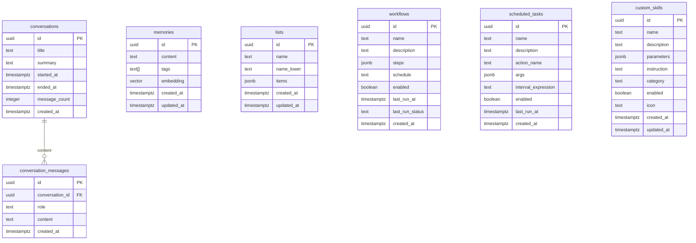

# Schéma de base de données — Leanna

La base de données est hébergée sur **Supabase** (PostgreSQL managé). Deux extensions sont activées :

- **`pgvector`** — recherche par similarité vectorielle (dimension 768, modèles Google GenAI)
- **`pg_trgm`** — recherche textuelle par trigrammes (index GIN)

> ⚠️ Supabase est optionnel. Si `SUPABASE_URL` et `SUPABASE_SERVICE_ROLE_KEY` ne sont pas configurés, les fonctionnalités dépendantes (mémoires, historique, workflows, custom skills, agents) sont désactivées silencieusement. Le reste de l'application fonctionne en mode dégradé.

**Politique d'accès :** Toutes les tables ont le **Row Level Security (RLS) activé**. Seul le `service_role` (backend) a accès. Le frontend n'a aucun accès direct à Supabase.

---

## Tables

### `memories`

Mémoires long-terme de l'IA. Persistées par le skill `memory` et récupérées par RAG sémantique.

| Colonne | Type | Contraintes | Description |
|---|---|---|---|
| `id` | `uuid` | PK, default `gen_random_uuid()` | Identifiant unique |
| `content` | `text` | NOT NULL | Contenu textuel de la mémoire |
| `tags` | `text[]` | default `'{}'` | Tags pour le filtrage |
| `embedding` | `vector(768)` | nullable | Vecteur d'embedding pour la recherche sémantique |
| `created_at` | `timestamptz` | NOT NULL, default `now()` | Date de création |
| `updated_at` | `timestamptz` | NOT NULL, default `now()` | Date de modification (auto-updaté par trigger) |

**Trigger :** `trg_memories_updated_at` — met à jour `updated_at` avant chaque `UPDATE`.

**Index :**
- `memories_content_idx` — `GIN (content gin_trgm_ops)` — recherche textuelle par trigrammes

**Fonction stockée :**

```sql
match_memories(
  query_embedding vector(768),
  match_threshold float,
  match_count int
) → table(id uuid, content text, similarity float)
```

Retourne les mémoires dont la similarité cosinus avec `query_embedding` est supérieure à `match_threshold`, triées par similarité décroissante.

**RLS :** `service_role` — accès total (SELECT, INSERT, UPDATE, DELETE)

---

### `lists`

Listes intelligentes gérées par l'IA (to-do, courses, notes structurées…).

| Colonne | Type | Contraintes | Description |
|---|---|---|---|
| `id` | `uuid` | PK, default `gen_random_uuid()` | Identifiant unique |
| `name` | `text` | NOT NULL | Nom d'affichage de la liste |
| `name_lower` | `text` | NOT NULL, UNIQUE (index) | Nom normalisé en minuscules (recherche insensible à la casse) |
| `items` | `jsonb` | NOT NULL, default `'[]'` | Éléments de la liste (tableau JSON) |
| `created_at` | `timestamptz` | NOT NULL, default `now()` | Date de création |
| `updated_at` | `timestamptz` | NOT NULL, default `now()` | Date de modification |

**Index :**
- `lists_name_lower_unique` — UNIQUE sur `name_lower` (contrainte de nommage)
- `lists_updated_at_idx` — `BTREE (updated_at DESC)` — tri par date de modification

**RLS :** `service_role` — accès total

---

### `conversations`

Sessions de conversation entre l'utilisateur et l'IA.

| Colonne | Type | Contraintes | Description |
|---|---|---|---|
| `id` | `uuid` | PK, default `gen_random_uuid()` | Identifiant unique |
| `title` | `text` | nullable | Titre de la conversation (généré automatiquement) |
| `summary` | `text` | nullable | Résumé généré par l'IA |
| `started_at` | `timestamptz` | NOT NULL, default `now()` | Début de la session |
| `ended_at` | `timestamptz` | nullable | Fin de la session |
| `message_count` | `integer` | default `0` | Nombre de messages |
| `created_at` | `timestamptz` | NOT NULL, default `now()` | Date de création de l'enregistrement |

**RLS :** `service_role` — accès total

---

### `conversation_messages`

Messages individuels d'une conversation.

| Colonne | Type | Contraintes | Description |
|---|---|---|---|
| `id` | `uuid` | PK, default `gen_random_uuid()` | Identifiant unique |
| `conversation_id` | `uuid` | NOT NULL, FK → `conversations.id` ON DELETE CASCADE | Conversation parente |
| `role` | `text` | NOT NULL, CHECK (`user` \| `assistant`) | Rôle de l'émetteur |
| `content` | `text` | NOT NULL | Contenu du message |
| `created_at` | `timestamptz` | NOT NULL, default `now()` | Horodatage |

**Index :**
- `idx_conversation_messages_conversation_id` — `BTREE (conversation_id)` — jointure rapide
- `idx_conversation_messages_content_search` — `GIN (to_tsvector('french', content))` — recherche full-text

**Fonction stockée :**

```sql
search_conversations(
  search_query text,
  result_limit int DEFAULT 20
) → table(message_id uuid, conversation_id uuid, conversation_title text, role text, content text, created_at timestamptz, rank real)
```

Recherche full-text en français (`plainto_tsquery`) avec ranking `ts_rank`. Retourne les messages correspondants avec leur contexte de conversation.

**RLS :** `service_role` — accès total

---

### `workflows`

Pipelines d'actions chainées, optionnellement planifiées.

| Colonne | Type | Contraintes | Description |
|---|---|---|---|
| `id` | `uuid` | PK, default `gen_random_uuid()` | Identifiant unique |
| `name` | `text` | NOT NULL | Nom du workflow |
| `description` | `text` | default `''` | Description |
| `steps` | `jsonb` | NOT NULL, default `'[]'` | Étapes du pipeline (tableau JSON) |
| `schedule` | `text` | nullable | Expression d'intervalle (`"24h"`, `"30m"`). `NULL` = non planifié |
| `enabled` | `boolean` | default `true` | Actif ou désactivé |
| `last_run_at` | `timestamptz` | nullable | Dernière exécution |
| `last_run_status` | `text` | nullable | Statut : `success` \| `partial` \| `failed` |
| `created_at` | `timestamptz` | NOT NULL, default `now()` | Date de création |

**Index :**
- `idx_workflows_enabled_schedule` — `BTREE (enabled)` WHERE `schedule IS NOT NULL` — filtrage rapide des workflows planifiés actifs (partial index)

**RLS :** `service_role` — accès total

---

### `scheduled_tasks`

Tâches d'automatisation périodiques (exécution d'un skill à intervalle régulier).

| Colonne | Type | Contraintes | Description |
|---|---|---|---|
| `id` | `uuid` | PK, default `gen_random_uuid()` | Identifiant unique |
| `name` | `text` | NOT NULL | Nom de la tâche |
| `description` | `text` | nullable | Description optionnelle |
| `action_name` | `text` | NOT NULL | Nom du skill à appeler |
| `args` | `jsonb` | default `'{}'` | Arguments passés au skill |
| `interval_expression` | `text` | NOT NULL | Intervalle (`"24h"`, `"10m"`…) |
| `enabled` | `boolean` | default `true` | Actif ou désactivé |
| `last_run_at` | `timestamptz` | nullable | Dernière exécution |
| `created_at` | `timestamptz` | NOT NULL, default `now()` | Date de création |

**RLS :** `service_role` — accès total

---

### `custom_skills`

Skills IA personnalisés créés par l'utilisateur via l'interface.

| Colonne | Type | Contraintes | Description |
|---|---|---|---|
| `id` | `uuid` | PK, default `gen_random_uuid()` | Identifiant unique |
| `name` | `text` | NOT NULL, UNIQUE | Nom unique du skill (ex: `résumé_youtube`) |
| `description` | `text` | NOT NULL, default `''` | Description pour l'IA |
| `parameters` | `jsonb` | NOT NULL, default `'[]'` | Paramètres : `[{name, type, description, required}]` |
| `instruction` | `text` | NOT NULL, default `''` | Prompt/instruction exécuté par l'IA |
| `category` | `text` | NOT NULL, default `'custom'` | Catégorie : `custom` \| `automation` \| `web` \| `data`… |
| `enabled` | `boolean` | NOT NULL, default `true` | Actif ou désactivé |
| `icon` | `text` | default `'Sparkles'` | Nom d'icône Lucide |
| `created_at` | `timestamptz` | NOT NULL, default `now()` | Date de création |
| `updated_at` | `timestamptz` | NOT NULL, default `now()` | Date de modification |

**Trigger :** `trg_custom_skills_updated_at` — met à jour `updated_at` avant chaque `UPDATE`.

**Index :**
- `idx_custom_skills_enabled` — `BTREE (enabled)` WHERE `enabled = true` — partial index pour charger uniquement les skills actifs

**RLS :** `auth.role() = 'service_role'` — accès exclusif au backend

---

### `token_usage`

Suivi des coûts et de la consommation de tokens (Observabilité V1.1). Chaque appel modèle (Gemini / OpenRouter) est enregistré par `TelemetryService` puis flushé périodiquement. Source du tableau de bord Coûts & Tokens (`/api/observability`).

| Colonne | Type | Contraintes | Description |
|---|---|---|---|
| `id` | `text` | PK | Identifiant unique généré par `TelemetryService` |
| `mission_id` | `text` | nullable | Mission à laquelle l'appel est rattaché |
| `task_id` | `text` | nullable | Tâche agent à l'origine de l'appel |
| `agent_role` | `text` | nullable | Rôle de l'agent (coder, debugger…) |
| `tool_name` | `text` | nullable | Outil ayant déclenché l'appel |
| `provider` | `text` | NOT NULL | `gemini` ou `openrouter` |
| `model` | `text` | NOT NULL | Modèle utilisé (ex: `gemini-2.5-flash`) |
| `input_tokens` | `integer` | NOT NULL, default `0` | Tokens en entrée (prompt) |
| `output_tokens` | `integer` | NOT NULL, default `0` | Tokens en sortie (complétion) |
| `total_tokens` | `integer` | NOT NULL, default `0` | Total des tokens |
| `cost_usd` | `double precision` | NOT NULL, default `0` | Coût estimé en USD |
| `created_at` | `timestamptz` | NOT NULL, default `now()` | Date de l'appel |

**Index :**
- `token_usage_created_at_idx` — `(created_at desc)` — agrégations par période
- `token_usage_mission_id_idx` — `(mission_id)` — coût par mission
- `token_usage_agent_role_idx` — `(agent_role)` — coût par agent
- `token_usage_model_idx` — `(model)` — coût par modèle

**Vues :** `token_usage_daily_by_model` (coût quotidien par modèle) et `token_usage_by_mission` (coût par mission).

**RLS :** `service_role` — accès total.

---

## Relations

```
conversations
    └─── conversation_messages (1:N, cascade delete)
```

Les autres tables sont indépendantes (pas de clés étrangères entre elles).

---

## Migrations

Les migrations sont dans `supabase/migrations/`. Une seule migration est actuellement versionnée :

| Fichier | Date | Description |
|---|---|---|
| `20260726000000_memories_updated_at.sql` | 2026-07-26 | Ajout du trigger `updated_at` sur la table `memories` |

Pour appliquer les schémas initiaux, exécuter dans le SQL Editor Supabase (dans l'ordre) :

```bash
supabase/supabase_schema.sql          # memories + lists + pgvector + pg_trgm
supabase/conversations_schema.sql     # conversations + conversation_messages
supabase/workflows_schema.sql         # workflows
supabase/scheduled_tasks_schema.sql   # scheduled_tasks
supabase/custom_skills_schema.sql     # custom_skills
supabase/token_usage_schema.sql       # token_usage (observabilité coûts & tokens)
supabase/autonomy_tasks_schema.sql    # autonomy_tasks (task store durable du TaskManager)
```

Pour la persistance des agents (optionnel), exécuter le SQL retourné par :

```
GET /api/agents/persistence/migration
```

---

## Diagramme ERD


