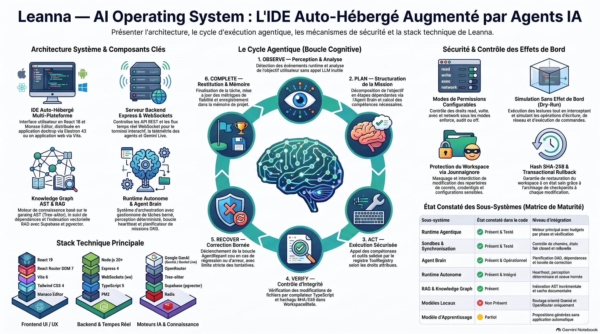

# Leanna — AI Operating System




> **Leanna est un IDE augmenté par IA qui réunit un éditeur de code, un terminal, des agents outillés, une mémoire de projet et des mécanismes de contrôle des effets de bord.**


Leanna est une application TypeScript composée d’un frontend React/Vite, d’un serveur Express avec API REST et WebSockets, ainsi que d’une application desktop Electron. Elle permet d’explorer et de modifier le workspace du projet, d’exécuter des outils spécialisés, de déléguer des tâches à des agents et de suivre les opérations depuis une interface unique.

Le dépôt contient également un runtime autonome événementiel, un système de missions, un Knowledge Graph, des notebooks RAG, des workflows planifiés, une intégration Gemini/OpenRouter, un bot Telegram optionnel et plusieurs couches de sécurité.

> **État du produit.** Les briques principales sont présentes et testées, mais toutes les capacités annoncées par la vision du projet ne sont pas au même niveau de maturité. Le README distingue donc les fonctions effectivement implémentées des fonctions optionnelles ou encore en évolution.


## Sommaire

- [Fonctionnalités](#fonctionnalités)
- [État réel des principaux sous-systèmes](#état-réel-des-principaux-sous-systèmes)
- [Architecture](#architecture)
- [Stack technique](#stack-technique)
- [Prérequis](#prérequis)
- [Installation](#installation)
- [Configuration](#configuration)
- [Lancement](#lancement)
- [Sécurité et garde-fous](#sécurité-et-garde-fous)
- [Utilisation de l’Agent Brain](#utilisation-de-lagent-brain)
- [Tests et qualité](#tests-et-qualité)
- [Structure du dépôt](#structure-du-dépôt)
- [Dépannage](#dépannage)
- [Documentation](#documentation)
- [Contribution](#contribution)
- [Licence](#licence)

## Fonctionnalités

### IDE et workspace

Le frontend React fournit une interface IDE comprenant notamment :

- éditeur Monaco avec onglets et explorateur de fichiers ;
- terminal interactif via WebSocket ;
- recherche globale dans le workspace ;
- aperçu Markdown, PDF et images ;
- historique des conversations et checkpoints ;
- palette de commandes et raccourcis clavier ;
- thèmes clair et sombre ;
- gestion des paramètres, du profil et des tokens ;
- suivi de l’activité des agents et de la timeline d’autonomie ;
- partage d’écran et capture webcam lorsque le navigateur les autorise.


### Agents, skills et outils

Le serveur enregistre des skills pour l’automatisation, le navigateur, l’analyse du code, GitHub, la mémoire, la connaissance du projet, les documents, les missions, le temps, la vérification, Telegram et d’autres opérations spécialisées.

Les agents disposent d’un moteur partagé qui encadre le cycle :

```text
OBSERVE → PLAN → ACT → VERIFY → RECOVER → COMPLETE
```

Le runtime agentique fournit réellement les outils autorisés à l’agent. Les appels passent par le `ToolRegistry`, qui centralise les permissions, le dry-run, les timeouts et les métriques. Les écritures peuvent être relues et vérifiées par hash SHA-256 dans `WorkspaceState`. La boucle `AgentRepairLoop` limite les corrections lorsque le patch se répète, qu’aucun progrès n’est constaté ou qu’une régression est détectée.

### Agent Brain et missions

`AgentBrain` transforme un objectif en étapes dépendantes et s’appuie sur `BrainScheduler` pour exécuter les étapes prêtes, gérer les dépendances, propager les échecs et produire un résultat d’exécution. La vérification peut utiliser `WorkspaceState` et des enregistrements hashés.

Le système de missions fournit une couche distincte pour planifier, exécuter, réfléchir, corriger, réessayer ou escalader une mission. Les routes d’agents, de missions et de checkpoints sont exposées par le serveur Express.

### Connaissance, mémoire et notebooks

Le dépôt contient plusieurs mécanismes complémentaires :

- **Knowledge Graph** : parsing AST, graphe d’appels, dépendances, analyse d’impact et indexation incrémentale ;
- **mémoire de projet** et mémoire hiérarchique ;
- **recherche sémantique** et index documentaire ;
- **notebooks RAG** avec ingestion de sources, embeddings, recherche hybride, cache et citations ;
- export HTML, DOCX et PDF ;
- génération de diagrammes Mermaid et fonctions de synthèse ou de synthèse vocale selon les providers configurés.

### Intégrations optionnelles

Leanna peut intégrer, si les variables correspondantes sont configurées :

- Gemini pour le texte et Gemini Live ;
- OpenRouter comme provider alternatif ou de secours ;
- Supabase pour la persistance, les migrations et le stockage des mémoires ;
- Redis pour le cache, les verrous distribués et l’EventBus multi-processus ;
- GitHub ;
- navigateur automatisé via Puppeteer ;
- MCP, le Model Context Protocol ;
- FTP ;
- PM2 pour la supervision ;
- Telegram via `grammy` et Long Polling.

## État réel des principaux sous-systèmes

Le code et les audits inclus dans le dépôt permettent de distinguer les capacités suivantes :

| Sous-système | État constaté dans le code |
|---|---|
| Sandbox et synchronisation | Présents, avec contrôles de chemins, états fail-closed, checkpoints et rollback transactionnel. |
| Runtime agentique | Présent et utilisé comme moteur principal pour les tâches agentiques ; outils, budgets par phase, vérification et réparation bornée sont couverts par des tests dédiés. |
| Agent Brain | Présent avec planification, scheduler, dépendances, vérification et correction ; les limites de concurrence, d’annulation et certains branchements restent dépendants des couches appelantes. |
| Runtime autonome | Présent avec heartbeat, perception, déduplication, queue bornée, retries, timeout, circuit breaker et persistance optionnelle. L’autonomie doit être configurée et intégrée au pipeline de missions pour produire des actions utiles. |
| RAG et Knowledge Graph | Présents avec indexation, mémoire, recherche documentaire et cache. Le comportement dépend du workspace actif et des providers configurés. |
| Observabilité | Traces et métriques internes présentes. L’export OpenTelemetry externe n’est pas configuré par défaut ; `OTEL_CONSOLE_EXPORT` permet un export console. |
| Modèles locaux | Non présents dans le routeur actuel. Les providers pris en charge par le code sont Gemini et OpenRouter. |
| Apprentissage | Le `LearningEngine` produit des propositions et des éléments de mémoire ; ces propositions ne sont pas appliquées automatiquement à la configuration ou au workspace. |

Cette distinction est importante : **le README décrit le comportement du code actuel et non uniquement la vision du produit**. Pour les travaux futurs, consultez [`ROADMAP.md`](ROADMAP.md), qui recense les écarts et les évolutions prévues.

## Architecture

```text
┌────────────────────────────────────────────────────┐
│ React + Vite + Monaco + Electron                   │
│ IDE, vues, panneaux, notebooks, paramètres         │
└──────────────────────────┬─────────────────────────┘
                           │ REST / WebSocket
┌──────────────────────────▼─────────────────────────┐
│ Express                                            │
│ routes agents, missions, IDE, terminal, documents │
│ GitHub, MCP, sandbox, mémoire, Telegram, export    │
└───────────────┬───────────────────┬────────────────┘
                │                   │
┌───────────────▼──────────┐ ┌──────▼────────────────┐
│ Runtime agentique        │ │ Connaissance et mémoire│
│ ToolRegistry             │ │ Knowledge Graph        │
│ PermissionPolicy         │ │ RAG / notebooks       │
│ DryRunController         │ │ ProjectMemory         │
│ WorkspaceState           │ │ Supabase / Redis       │
└───────────────┬──────────┘ └────────────────────────┘
                │
┌───────────────▼─────────────────────────────────────┐
│ Agent Brain, missions et autonomie                  │
│ planification → exécution → vérification → correction│
└───────────────────────────────────────────────────────┘
```

Les points d’entrée principaux sont :

- `src/main.tsx` pour le frontend ;
- `server-bootstrap.ts` pour le chargement de l’environnement et la validation de la configuration ;
- `server.ts` pour l’initialisation du serveur, des routes, des WebSockets, des skills, des notebooks et du runtime ;
- `electron/main.cjs` pour l’application desktop.

Au démarrage, le serveur charge les tâches planifiées et les workflows, restaure éventuellement les tâches persistées, puis indexe le projet actif et démarre la surveillance incrémentale des fichiers.

## Stack technique

| Technologie | Utilisation |
|---|---|
| React 19 | Interface utilisateur |
| React Router DOM 7 | Routage frontend |
| Vite 6 | Développement et build frontend |
| TypeScript 5 | Frontend et backend |
| Tailwind CSS 4 | Styles et tokens UI |
| Express 4 | API HTTP |
| `ws` | WebSockets pour le temps réel, le terminal et les flux d’activité |
| Electron 43 | Application desktop, principalement Windows |
| Monaco Editor | Éditeur de code |
| Google GenAI | Gemini texte et voix |
| Supabase | PostgreSQL, persistance et pgvector lorsque configuré |
| Redis | Cache et coordination optionnelle |
| Puppeteer | Automatisation navigateur |
| Mermaid | Diagrammes de plans et de connaissance |
| Tree-sitter | Analyse AST JavaScript/TypeScript |
| Grammy | Bot Telegram |
| PM2 | Supervision de production |

Les versions exactes sont définies dans [`package.json`](package.json).

## Prérequis

- Node.js **20 ou supérieur** ;
- npm compatible avec le projet ;
- Git ;
- un navigateur Chromium installé si l’automatisation Puppeteer est utilisée ;
- une clé Gemini si les fonctions IA Gemini sont utilisées ;
- Supabase, Redis, GitHub, OpenRouter ou Telegram uniquement pour les fonctions correspondantes.

Le serveur fonctionne sous Linux, macOS et Windows. La distribution Electron configurée par `electron-builder` cible Windows en x64.

## Installation

### 1. Installer le projet

```bash
git clone <URL_DU_DEPOT>
cd leanna
npm install
```

Le projet utilise `server-bootstrap.ts` pour charger `.env`, puis `.env.local` avec priorité sur `.env`.

### 2. Créer la configuration locale

```bash
cp .env.example .env
```

Sous Windows PowerShell :

```powershell
Copy-Item .env.example .env
```

Pour un démarrage minimal avec les fonctionnalités Gemini, définissez au moins :

```env
GEMINI_API_KEY=votre_cle_gemini
```

`Leanna_API_TOKEN` et `Leanna_MASTER_KEY` peuvent être générés au premier démarrage s’ils sont laissés vides. Le token API donne accès aux routes protégées et doit être conservé comme un secret. La clé maître est nécessaire pour déchiffrer les données sensibles déjà enregistrées ; sauvegardez-la avant toute utilisation en production.

### 3. Démarrer en développement

```bash
npm run dev
```

Le serveur écoute par défaut sur le port `4000`, généralement à l’adresse :

```text
http://127.0.0.1:4000
```

## Configuration

Les variables principales sont les suivantes :

| Variable | Rôle | Valeur par défaut ou remarque |
|---|---|---|
| `GEMINI_API_KEY` | Provider Gemini principal | Recommandée pour les fonctions IA |
| `GEMINI_API_KEY_1`, etc. | Pool de clés Gemini | Permet la rotation lors des erreurs de quota |
| `Leanna_API_TOKEN` | Authentification API et WebSockets | Généré automatiquement s’il est vide |
| `Leanna_MASTER_KEY` | Chiffrement des secrets | Générée automatiquement si elle est vide |
| `VITE_SERVER_PORT` | Port HTTP du serveur | `4000` |
| `Leanna_LISTEN_HOST` | Adresse d’écoute | `127.0.0.1` recommandé en local |
| `Leanna_PERMISSION_MODE` | Contrôle des permissions | `enforce`, `audit` ou `off` ; `enforce` recommandé |
| `Leanna_GRANTED_PERMISSIONS` | Permissions globales CSV | Par exemple `read,write` |
| `Leanna_DRY_RUN` | Simulation sans effets de bord | `false` |
| `SUPABASE_URL` | URL Supabase | Les deux variables Supabase doivent être définies ensemble |
| `SUPABASE_SERVICE_ROLE_KEY` | Clé de service Supabase | Ne jamais la publier |
| `OPENROUTER_API_KEY` | Provider OpenRouter | Optionnel |
| `OPENROUTER_MODEL` | Modèle OpenRouter | Optionnel |
| `LEANNA_PROVIDER_FALLBACK` | Fallback Gemini/OpenRouter | `true` dans `.env.example` |
| `REDIS_URL` | Cache Redis | Optionnel ; repli mémoire/disque sans Redis |
| `GITHUB_TOKEN` | Opérations GitHub | Optionnel |
| `TELEGRAM_BOT_TOKEN` | Bot Telegram | Optionnel |
| `PUPPETEER_EXECUTABLE_PATH` | Chromium personnalisé | Optionnel |
| `OTEL_CONSOLE_EXPORT` | Export des traces en console | Vide par défaut |

Le runtime autonome utilise notamment `LEANNA_HEARTBEAT_ACTIVE_MS`, `LEANNA_HEARTBEAT_IDLE_MS`, `LEANNA_HEARTBEAT_SLEEP_MS`, `LEANNA_AUTONOMY_MAX_CONCURRENCY`, `LEANNA_AUTONOMY_MAX_QUEUE_SIZE`, `LEANNA_AUTONOMY_MAX_RETRIES` et `LEANNA_AUTONOMY_TASK_TIMEOUT_MS`.

La liste complète et les commentaires associés se trouvent dans [`.env.example`](.env.example). Pour Supabase, les schémas SQL sont disponibles dans [`supabase/`](supabase/).

## Lancement

### Développement

```bash
npm run dev
```

### Build et production

```bash
npm run build
npm start
```

### Prévisualisation du frontend

```bash
npm run preview
```

### Application Electron

```bash
npm run desktop
npm run desktop:debug
```

### Packaging Windows

```bash
npm run pack:win
npm run dist:win
```

Les artefacts Electron sont générés dans `release/`.

### PM2

Après le build :

```bash
npm run build
pm2 start ecosystem.config.cjs
pm2 status
pm2 logs leanna
pm2 save
```

Le panneau PM2 et les routes correspondantes supposent que PM2 est installé et accessible dans le `PATH` du processus serveur.

## Sécurité et garde-fous

### Permissions par outil

Chaque skill ou outil peut déclarer les permissions suivantes :

| Permission | Signification |
|---|---|
| `read` | Lire des fichiers ou des ressources |
| `write` | Créer, modifier, supprimer ou renommer |
| `network` | Utiliser le réseau sortant |
| `exec` | Exécuter une commande ou un processus |

Avec `Leanna_PERMISSION_MODE=enforce`, un appel qui exige une permission non accordée est refusé. Pour limiter explicitement l’environnement :

```env
Leanna_PERMISSION_MODE=enforce
Leanna_GRANTED_PERMISSIONS=read,write
```

### Dry-run

Le dry-run exécute les lectures, mais intercepte les opérations `write`, `exec` et `network` :

```env
Leanna_DRY_RUN=true
```

Il peut également être activé mission par mission via l’API ou le skill de mission.

### `.leannaignore`

Copiez [`.leannaignore.example`](.leannaignore.example) en `.leannaignore` à la racine du workspace pour interdire à l’agent de modifier certains chemins :

```bash
cp .leannaignore.example .leannaignore
```

Le format est proche de `.gitignore`. Les règles prennent effet immédiatement et sont également appliquées à la sandbox. Les dossiers de secrets, les credentials, les configurations de production et les migrations déjà appliquées devraient être exclus.

### Secrets du dépôt

Ne commitez jamais `.env`, `.env.local`, une clé Supabase de service, une clé Gemini, un token GitHub, un token Telegram ou une clé maître. Si un secret a déjà été ajouté à Git, révoquez-le et remplacez-le ; le supprimer du fichier courant ne suffit pas à l’effacer de l’historique.

## Utilisation de l’Agent Brain

Depuis l’interface, formulez un objectif en langage naturel, par exemple :

```text
Analyse les erreurs TypeScript du projet et propose une correction vérifiée.
```

### Générer un plan

```bash
curl -X POST http://127.0.0.1:4000/api/agents/brain/plan \
  -H "Content-Type: application/json" \
  -H "x-leanna-token: <Leanna_API_TOKEN>" \
  -d '{"goal":"Analyse les erreurs TypeScript du projet"}'
```

### Exécuter une mission

```bash
curl -X POST http://127.0.0.1:4000/api/agents/brain/execute \
  -H "Content-Type: application/json" \
  -H "x-leanna-token: <Leanna_API_TOKEN>" \
  -d '{"goal":"Corrige les erreurs TypeScript et vérifie le résultat"}'
```

### Suivre l’exécution

```bash
curl -H "x-leanna-token: <Leanna_API_TOKEN>" \
  http://127.0.0.1:4000/api/agents/brain/status/<planId>
```

L’API comporte également des routes pour les agents, les missions, le sandbox, les checkpoints, les documents, les notebooks, les mémoires, les workflows, GitHub, MCP, le terminal et l’audit. La liste détaillée est dans [`API_DOCS.md`](API_DOCS.md).

## Tests et qualité

Les scripts disponibles sont définis dans `package.json` :

```bash
npm test
npm run typecheck
npm run lint
npm run audit:deps
npm run audit:deps:full
npm run ui:audit
npm run brain:smoke
npm run test:soak
```

Pour le smoke test du Brain, démarrez d’abord le serveur avec `npm run dev`, puis lancez :

```bash
npm run brain:smoke
```

Le script peut accepter un objectif et une exécution complète selon les options définies dans `scripts/brain-smoke.mjs`.

Les tests couvrent notamment les routes REST, l’authentification, le sandbox, le runtime agentique, le contrat `AgentTaskRunner`, le Brain, les missions, l’autonomie, les notebooks, les skills, les WebSockets et la sécurité.

## Structure du dépôt

```text
leanna/
├── electron/                 # Processus principal, preload et écran de démarrage Electron
├── server/
│   ├── agents/               # Agents, orchestration, délégation et Agent Brain
│   ├── autonomy/             # Heartbeat, perception, queue et autonomie
│   ├── config/               # Validation d’environnement et limites
│   ├── knowledge/             # AST, Knowledge Graph, indexation et mémoire projet
│   ├── live/                 # Gemini Live et temps réel
│   ├── marketplace/           # Registry marketplace
│   ├── mcp/                  # Bridge et client MCP
│   ├── mission/              # Planification et exécution des missions
│   ├── notebooks/            # Sources, embeddings, RAG et notebooks
│   ├── routes/               # Routes HTTP et WebSocket
│   ├── runtime/              # ToolRegistry, permissions et runtime agentique
│   ├── skills/               # Skills natives
│   ├── telegram/             # Service Telegram
│   ├── utils/                # Crypto, sandbox, logs, fichiers et providers
│   └── workflows/            # Workflows planifiés
├── src/                      # Frontend React
│   ├── components/           # IDE, panneaux, notebooks et UI
│   ├── context/              # Contextes React
│   ├── hooks/                # Hooks applicatifs
│   ├── services/             # Clients API et services frontend
│   ├── stores/               # État global
│   └── views/                # Vues principales
├── supabase/                 # Schémas et migrations SQL
├── scripts/                  # Lint, smoke tests et audits UI
├── docs/                     # Audits, contrats et rapports techniques
├── server.ts                 # Initialisation du serveur
├── server-bootstrap.ts       # Chargement et validation de l’environnement
├── vite.config.ts            # Configuration Vite
├── ecosystem.config.cjs      # Configuration PM2
├── package.json              # Dépendances et scripts
└── .env.example              # Modèle de configuration
```

## Dépannage

### `401 Unauthorized`

Lorsque `Leanna_API_TOKEN` est défini, ajoutez l’en-tête :

```text
x-leanna-token: <Leanna_API_TOKEN>
```

La route `/api/health` est prévue pour rester accessible pour le diagnostic.

### Supabase refusé au démarrage

`SUPABASE_URL` et `SUPABASE_SERVICE_ROLE_KEY` doivent être définies ensemble. Vérifiez également que l’URL utilise `http://` ou `https://`, puis appliquez les schémas du dossier [`supabase/`](supabase/).

### `GET /api/pm2/status` retourne `503`

Vérifiez l’installation et la disponibilité de PM2 :

```bash
pm2 --version
pm2 ping
pm2 list
```

### Gemini ou Gemini Live ne répond pas

Vérifiez `GEMINI_API_KEY`, le quota du provider et les logs du serveur. Plusieurs clés `GEMINI_API_KEY_N` peuvent être utilisées par le pool de clés. OpenRouter peut être configuré comme provider de secours avec `LEANNA_PROVIDER_FALLBACK=true`.

### Puppeteer ne trouve pas Chromium

Installez un navigateur Chromium compatible ou définissez explicitement :

```env
PUPPETEER_EXECUTABLE_PATH=/chemin/vers/chromium
```

### Le projet n’est pas indexé

Le Knowledge Graph attend un projet actif. Vérifiez que le workspace contient le code attendu et consultez les logs `[KnowledgeGraph]` et `[WorkspaceIndexer]` au démarrage.

## Documentation

- [`API_DOCS.md`](API_DOCS.md) — routes REST et WebSockets ;
- [`ARCHITECTURE.md`](ARCHITECTURE.md) — architecture technique ;
- [`DB_SCHEMA.md`](DB_SCHEMA.md) — schémas de données ;
- [`AUTONOMY.md`](AUTONOMY.md) — runtime autonome ;
- [`AUTONOMY_AUDIT.md`](AUTONOMY_AUDIT.md) — audit de l’autonomie ;
- [`docs/AGENTIC_RUNTIME.md`](docs/AGENTIC_RUNTIME.md) — runtime agentique et vérification ;
- [`docs/AUTONOMOUS_AGENT_AUDIT.md`](docs/AUTONOMOUS_AGENT_AUDIT.md) — audit de la boucle autonome ;
- [`docs/AUTONOMY_CONTRACT.md`](docs/AUTONOMY_CONTRACT.md) — contrat d’autonomie ;
- [`docs/LEANNA_EXECUTION_REALITY_AUDIT.md`](docs/LEANNA_EXECUTION_REALITY_AUDIT.md) — audit de réalité d’exécution ;
- [`ROADMAP.md`](ROADMAP.md) — état, écarts et feuille de route ;
- [`SELF_IDE.md`](SELF_IDE.md) — fonctionnement de l’IDE ;
- [`.env.example`](.env.example) — configuration commentée ;
- [`.leannaignore.example`](.leannaignore.example) — modèle d’exclusion des chemins.

## Contribution

Avant toute modification :

1. créez une branche dédiée ;
2. installez les dépendances avec `npm install` ;
3. exécutez `npm run typecheck`, `npm run lint` et `npm test` ;
4. vérifiez les changements de sécurité, de permissions et de gestion des secrets ;
5. mettez à jour la documentation concernée.

Les composants sensibles doivent conserver des tests associés. Une modification d’un outil doit notamment vérifier son attribution, ses permissions, son comportement en dry-run et sa traçabilité.

## Licence

Leanna est distribué sous licence **Business Source License 1.1 (BUSL-1.1)**. Consultez [`LICENSE`](LICENSE) pour les conditions complètes.

## Références

[1]: API_DOCS.md "Documentation de l’API Leanna"
[2]: ARCHITECTURE.md "Architecture technique de Leanna"
[3]: AUTONOMY.md "Runtime autonome de Leanna"
[4]: ROADMAP.md "État réel et feuille de route de Leanna"
[5]: docs/AGENTIC_RUNTIME.md "Runtime agentique de Leanna"
[6]: package.json "Scripts et dépendances du projet"
[7]: .env.example "Variables d’environnement documentées"
[8]: LICENSE "Licence Business Source License 1.1"

> **Note de maintenance.** Ce README doit être mis à jour lorsque `package.json`, les routes principales, le modèle de permissions ou les contrats du runtime changent. Les audits et la roadmap doivent rester la source de vérité pour distinguer une capacité livrée d’un simple objectif de produit.

© 2026 Maysson — Leanna
